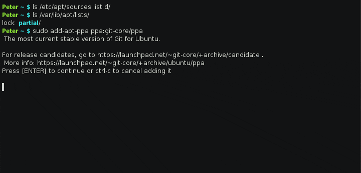

# add-apt-ppa 
Fetch the only corresponding apt package list immediately after added ppa repo.

## Installation
Download the released tarball from [releases page](https://github.com/PeterDaveHello/add-apt-ppa/releases), extract the files, checkin the directory, and run `make install` as root. You can also clone the repo via `git clone  https://github.com/PeterDaveHello/ColorEchoForShell.git` to get the files.

## Usage
All the same as add-apt-repository/apt-add-repository(in package:[software-properties-common]( http://packages.ubuntu.com/search?keywords=software-properties-common))

## The difference
Will do `apt-get update` **for the ppa repository** after added the repository. So that we don't need to do `apt-get udpate`, and can **save time and resource** because it will **only update info about the just added ppa repository**.

## Demo

## Author
[Peter Dave Hello](https://www.peterdavehello.org/), [@Twitter](https://twitter.com/PeterDaveHello), [@GitHub](https://github.com/PeterDaveHello)
